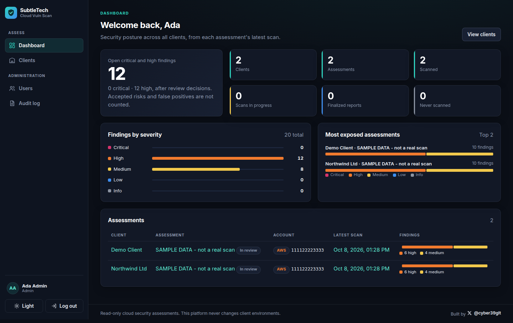

# CloudSecura

**Read-only cloud security assessments for AWS and Microsoft Azure.**

[](https://github.com/cyber39glt/Cloud-Vuln-Scan/actions/workflows/ci.yml)
[](LICENSE)

CloudSecura is a platform for security consultancies. It connects to a client's AWS
account or Azure subscription with **read-only** permissions, runs repeatable security
checks, backs every finding with evidence, lets consultants review the results, and
produces a client-ready report mapped to **CIS**, **NIST CSF 2.0** and **SOC 2**: as a
dashboard, PDF, CSV and JSON, all from one dataset.



## Features

- **Strictly read-only, enforced twice:** clients grant only the read permissions the
  checks use (generated from the code), and the platform blocks every non-read call
  before it is sent.
- **AWS and Azure:** AWS through a role with an ExternalId; Azure through a
  multi-tenant app with a custom read-only role. No agents, nothing installed.
- **19 checks** across identity, storage, network exposure, databases, logging and
  Microsoft Defender ([list](docs/rules.md#enabled-rules)), each recording pass, fail
  or "not evaluated" with the reason.
- **Evidence and framework mapping** for every finding.
- **Consultant review:** confirm, false positive, accepted risk or adjusted severity,
  each with a reason and full history; **finalization** freezes a signed report.
- **Reports:** PDF, CSV (formula-injection safe) and JSON with a published schema.
- **Secure by default:** mandatory authenticator-app MFA, invitation-only accounts,
  per-client access, append-only audit log, strict Content-Security-Policy, tamper
  evidence on stored results, hardened production deployment with automatic HTTPS.

## What it never does

It never modifies, creates or deletes anything in a client environment, never deploys
or installs anything there, never exploits vulnerabilities or performs intrusive
testing, and never reads business data or secret values. See [SECURITY.md](SECURITY.md).
**Use it only on environments you are authorized to assess.**

## Project status

**Version 0.1.0, pre-release** ([changelog](CHANGELOG.md)). All features above are
implemented and covered by automated tests. The AWS and Azure connectors have so far
been tested against **simulated** cloud APIs only; the first test against a real
sandbox account is described in [docs/aws-connection.md](docs/aws-connection.md) and
[docs/azure-connection.md](docs/azure-connection.md). Known limitations and open risks:
[docs/threat-model.md](docs/threat-model.md#residual-risks-accepted-or-deferred).

---

## Quick start (Windows)

### 1. Install prerequisites (once)

| Tool | Why | Get it |
|---|---|---|
| **Docker Desktop** | Runs the app and database in containers | https://www.docker.com/products/docker-desktop/ (use the WSL 2 backend) |
| **Git** | Version control | https://git-scm.com/download/win |
| **VS Code** (recommended) | Editor | https://code.visualstudio.com/ |

You do **not** need Python, PostgreSQL or any cloud SDK installed: they all run inside Docker.

### 2. Allow local PowerShell scripts (once)

Windows blocks scripts by default. In PowerShell, run:

```powershell
Set-ExecutionPolicy -Scope CurrentUser -ExecutionPolicy RemoteSigned
```

This allows scripts you create or clone locally, but still blocks unsigned scripts
downloaded from the internet.

### 3. Start the application

Make sure Docker Desktop is running, then from the repository folder:

```powershell
.\scripts\dev.ps1 up
```

The first run downloads images and installs dependencies (a few minutes). It also
creates your local `.env` file from `.env.example`.

### 4. Create your account and open the dashboard

```powershell
.\scripts\dev.ps1 users setup-code
```

It prints a one-time setup code. Open **http://localhost:5173**, click **Set up this
installation**, enter the code and your details, then set up your authenticator app
(scan the QR code). Invite colleagues from the **Users** page.
See [users.md](docs/users.md) and [the dashboard guide](docs/dashboard.md).

Health checks: http://localhost:8000/health and http://localhost:8000/health/ready.
Interactive API docs (development only): http://localhost:8000/docs

### 5. Stop it

```powershell
.\scripts\dev.ps1 down
```

---

## Production

One Linux server with Docker, automatic HTTPS and backups: follow
[docs/deployment.md](docs/deployment.md). Choosing a provider:
[docs/hosting.md](docs/hosting.md).

---

## Development commands

All commands are run from the repository root as `.\scripts\dev.ps1 <command>`.

| Command | What it does |
|---|---|
| `up` | Build and start PostgreSQL + API + scan worker + dashboard, then apply database migrations |
| `down` | Stop containers (database data is kept) |
| `restart` | `down` then `up` |
| `status` | Show containers and their health |
| `logs` | Follow API and worker logs (Ctrl+C to stop following); `logs worker` for the worker only |
| `test` | Run the backend test suite (extra args go to pytest, e.g. `test -k health`) |
| `webtest` | Type-check and test the dashboard |
| `policies` | Regenerate the least-privilege cloud permissions in `infra/` after adding or changing checks ([ADR 0025](docs/decisions/0025-least-privilege-and-security-review.md)) |
| `lint` | Ruff lint + format check |
| `format` | Auto-fix and format code with Ruff |
| `secrets` | Scan git history for committed secrets (Gitleaks) |
| `check` | `lint` + `test` + `webtest` + `secrets`: the same checks CI runs |
| `build` | Build the production image `cloud-vuln-scan-api:local` (API + worker + built dashboard) |
| `demo` | Run the rule engine on sample AWS + Azure data (`demo -json` for the full dataset; `demo -save "Demo Client"` stores it to try exports) |
| `users setup-code` | Show the code for the dashboard's first-run setup page (works only while there are no users) |
| `users create --admin --email ... --name ...` | Create an administrator on the command line instead (prints a one-time temporary password; [guide](docs/users.md)) |
| `users list` / `users reset-mfa --email ...` / `users reset-password --email ...` | List accounts; recover a lost authenticator or a forgotten/locked password |
| `aws external-id` | Generate an ExternalId for a client connection |
| `aws validate --account-id <id> --external-id <id>` | Check an AWS connection works and is read-only ([guide](docs/aws-connection.md)) |
| `clients add "Acme Ltd"` / `clients list` | Register and list clients |
| `aws connect --client "Acme Ltd" --account-id <id>` | Create the client's AWS connection and ExternalId |
| `aws scan --client "Acme Ltd" --account-id <id> [--assessment NAME] [--regions r1,r2] [--json]` | Run a read-only AWS assessment and **save** it |
| `aws scan --account-id <id> --external-id <id>` | One-off scan, printed only (not saved) |
| `assessments list --client "Acme Ltd"` / `assessments show --client ... --scan <id>` | View saved assessments and scans |
| `assessments export --client ... --scan <id> [--format pdf\|json\|csv\|all]` | Write PDF/JSON/CSV reports to `backend\exports\` ([details](docs/exports.md)) |
| `azure connect --client ... --tenant-id <guid> --subscription-id <guid>` | Register a client's Azure subscription and print onboarding steps |
| `azure validate --client ... --subscription-id <guid>` | Check an Azure connection works and is read-only ([guide](docs/azure-connection.md)) |
| `azure scan --client ... --subscription-id <guid> [--assessment NAME] [--regions r1,r2] [--json]` | Run a read-only Azure assessment and **save** it |
| `migrate` | Apply database migrations |
| `reset` | Stop everything **and delete the local database** (asks first) |

Code changes in `backend/` are picked up automatically while the app is running.
Rebuild (`restart`) only after changing dependencies in `backend/pyproject.toml`.

### Changing dependencies

Dependencies are declared in `backend/pyproject.toml` and pinned exactly in
`backend/uv.lock`. After editing `pyproject.toml`, regenerate the lockfile:

```powershell
docker compose run --rm --no-deps api uv lock
.\scripts\dev.ps1 restart
```

---

## Configuration

All settings come from environment variables. Locally they are read from `.env`
(git-ignored; created from [`.env.example`](.env.example), which documents every setting).

| Variable | Default | Purpose |
|---|---|---|
| `APP_ENV` | `development` | `development`, `test` or `production` |
| `LOG_LEVEL` | `INFO` | `DEBUG` is refused in production |
| `API_PORT` | `8000` | Port on your computer for the API |
| `POSTGRES_DB` / `POSTGRES_USER` | `cloudscan` | Database name and user |
| `POSTGRES_PASSWORD` | placeholder | Production refuses placeholder or short (<16 chars) values |
| `POSTGRES_OWNER_USER` / `POSTGRES_OWNER_PASSWORD` | empty | Production: the login that owns the tables and runs migrations; must differ from `POSTGRES_USER` ([ADR 0026](docs/decisions/0026-production-deployment.md)) |
| `DB_CONNECT_TIMEOUT_SECONDS` | `3` | Database connection timeout |
| `APP_SECRET_KEY` | generated by `dev.ps1` | Encrypts MFA secrets; production requires 32+ random characters |
| `SESSION_IDLE_MINUTES` / `SESSION_ABSOLUTE_HOURS` | `30` / `12` | Login session limits |
| `SESSION_COOKIE_SECURE` | `true` | HTTPS-only session cookie (works on `http://localhost` too); production refuses `false` |
| `API_ALLOWED_HOSTS` | `["localhost","127.0.0.1"]` | Host names the API answers to (JSON list) |
| `WORKER_POLL_SECONDS` | `2` | How often an idle worker checks for queued scans |
| `WORKER_STALE_AFTER_SECONDS` | `900` | A running scan silent for this long is marked interrupted |

In production, secrets are supplied by the hosting platform's secret manager, never a file.

---

## Project structure

```
.
├── backend/                 Python API (FastAPI)
│   ├── app/
│   │   ├── main.py          Application entry point
│   │   ├── api/             HTTP routes (auth, onboarding, admin, clients, assessments, reviews)
│   │   ├── auth/            Passwords, MFA, sessions, audit log
│   │   ├── worker.py        Background scan worker
│   │   ├── web.py           Serves the built dashboard
│   │   ├── core/            Configuration, logging, database
│   │   ├── domain/          Inventory, findings and evidence models
│   │   ├── rules/           Security rules and the rule engine
│   │   ├── frameworks/      CIS / NIST CSF / SOC 2 mappings
│   │   ├── providers/aws/   AWS connector: read-only guard, AssumeRole, collectors
│   │   ├── providers/azure/ Azure connector: pipeline guard, validation, collectors
│   │   ├── storage/         Database models, client-scoped data access, database roles
│   │   ├── policies.py      Generates the least-privilege client permissions
│   │   └── reporting/       Report dataset + PDF (templates/), JSON and CSV exports
│   ├── schemas/             Published JSON Schema of the JSON export
│   ├── migrations/          Alembic database migrations
│   ├── tests/               pytest tests
│   ├── Dockerfile           dev and prod container images
│   ├── pyproject.toml       Dependencies and tool settings
│   └── uv.lock              Exact pinned dependency versions
├── frontend/                Dashboard (React + TypeScript, built with Vite)
│   ├── src/pages/           Login, overview, clients, assessments, reports, admin
│   ├── src/api.ts           The only code that calls the API
│   └── package-lock.json    Exact pinned dependency versions
├── docs/
│   ├── architecture.md      Architecture overview and roadmap
│   └── decisions/           Architecture Decision Records (ADRs)
├── infra/aws/               CloudFormation: client read-only role (generated permissions); sandbox fixtures
├── infra/azure/             Custom read-only role (generated); sandbox fixtures
├── deploy/                  Production: compose.prod.yml, Caddyfile, init-env.sh
├── scripts/                 dev.ps1 (Windows development), CI smoke tests
├── docker-compose.yml       Local environment: PostgreSQL + API + worker + dashboard
├── .env.example             Documented configuration template
├── LICENSE, NOTICE          Apache-2.0 licence and third-party notices
└── .github/                 CI, Dependabot, issue and pull request templates
```

## Documentation

- [Architecture overview](docs/architecture.md)
- [Architecture decisions](docs/decisions/)
- [Writing a security rule](docs/rules.md)
- [AWS connection and sandbox testing](docs/aws-connection.md)
- [Azure connection and sandbox testing](docs/azure-connection.md)
- [Data model](docs/data-model.md)
- [Report exports (PDF/JSON/CSV)](docs/exports.md)
- [Using the dashboard](docs/dashboard.md)
- [User accounts and logging in](docs/users.md)
- [Using the API](docs/api.md)
- [Deployment guide](docs/deployment.md) and [hosting options](docs/hosting.md)
- [Threat model](docs/threat-model.md)
- [Public release checklist](docs/release-checklist.md)
- [Security policy](SECURITY.md)

## Contributing

Contributions are welcome: see [CONTRIBUTING.md](CONTRIBUTING.md) and the
[Code of Conduct](CODE_OF_CONDUCT.md). Report vulnerabilities privately
([SECURITY.md](SECURITY.md)), never in a public issue.

## Licence

[Apache License 2.0](LICENSE). Third-party notices: [NOTICE](NOTICE).

Created by [@cyber39glt](https://x.com/cyber39glt).
