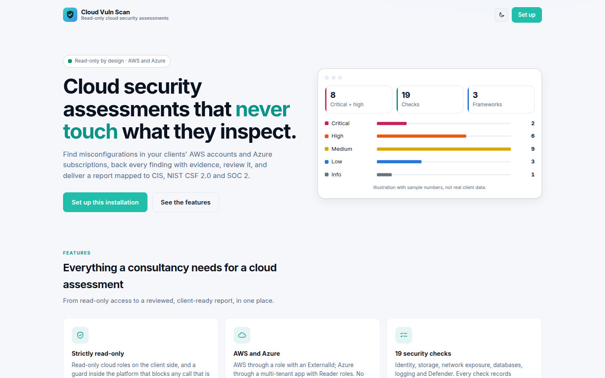
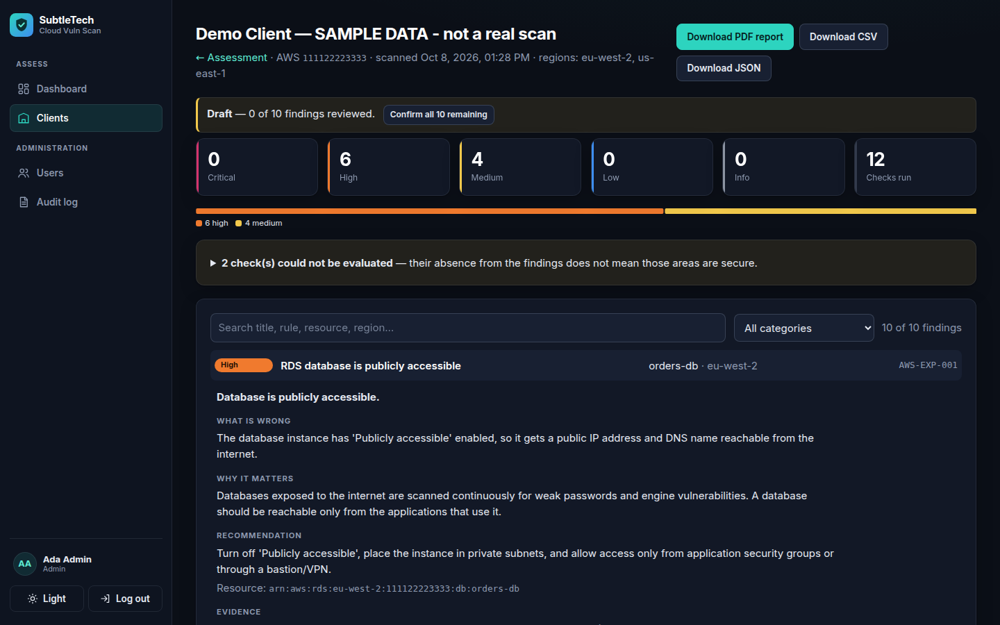

# Using the dashboard

The dashboard is the web interface of the platform. Start everything with
`.\scripts\dev.ps1 up` and open **http://localhost:5173** (development).
In production the API serves the dashboard itself at its own address.

First time? Set up the first administrator and log in as described in
[users.md](users.md).

Visitors who are not logged in see a **public showcase page** listing the features and
checks (no client data), with links to log in or, on a fresh installation, to set up.
Use the sun/moon button to switch between the **dark** (default) and **light** theme;
the choice is remembered in your browser.

*(Screenshots show the built-in sample data, not a real client.)*

## Pages

| Page | What you do there |
|---|---|
| **Dashboard** | Open critical and high findings, counts (clients, assessments, scans in progress, finalized reports), a findings-by-severity chart, the most exposed assessments, and every assessment with the severity counts of its latest scan. Counts follow review decisions |
| **Clients** | The clients you may access. Admins add new clients here |
| **Client** | Register the client's AWS account or Azure subscription and show the client's **setup steps** (AWS role name + ExternalId; Azure consent link + role commands); create assessments |
| **Assessment** | **Run read-only scan** (optionally limited to regions) and watch its progress live: connecting → collecting → evaluating → saving. Past scans and failures with a plain-language reason. **Finalize** the assessment when every finding is reviewed; Admins can **reopen** it with a reason |
| **Report** | Findings by severity (click a tile to filter), search, category filter; each finding opens to show what is wrong, why it matters, the recommendation, the **evidence** and the CIS / NIST CSF 2.0 / SOC 2 references. Each finding has a **Review** panel: confirm, mark as false positive or accepted risk, or change the severity (a justification is required except for confirm), with the full decision history. **Confirm all remaining** confirms every finding without a decision. Checks that could not be evaluated are listed separately. **Download PDF report** (client-ready, see [exports.md](exports.md)), CSV or JSON |
| **Users** (admins) | Invite people (one-time link), revoke pending invitations, change roles, assign consultants to clients, deactivate, reset MFA or password |
| **Audit log** (admins) | Who did what and when: logins, changes, data views, scans, exports |
| **Your account** (click your name) | Change your password; create new recovery codes |

## How a scan works

1. Register the cloud account on the client page. **Nothing is contacted.**
2. Send the client the setup steps. They grant **read-only** access (an AWS role or
   Azure Reader roles); see [aws-connection.md](aws-connection.md) and
   [azure-connection.md](azure-connection.md).
3. Create an assessment, then **Run read-only scan**. The scan runs in the background
   worker; you can leave the page.
4. Open the report when it is done. Every scan is stored unchanged with a SHA-256
   fingerprint shown at the bottom of the report.
5. Review every finding, then **Finalize** on the assessment page. The reviewed report
   is frozen (with its own SHA-256) and the assessment is locked; the PDF is no longer
   marked DRAFT. Reviews never change anything in the client's cloud.

If a scan fails, the assessment page says why (for example missing platform
credentials or access denied) and nothing is saved.

## Security notes

- The dashboard holds no secrets: the login session is an `HttpOnly` cookie the
  browser sends automatically, which page scripts cannot read.
- A strict Content-Security-Policy allows only the dashboard's own scripts and styles
  and connections to its own API (no inline code, no third-party content).
- Your session ends after 30 minutes without activity; the dashboard then shows the
  login page again.
- See [ADR 0021](decisions/0021-dashboard.md) for the design decisions.

## For developers

- Code: `frontend/` (React + TypeScript + Vite). `src/api.ts` is the only code that
  calls the API; pages are in `src/pages/`.
- Development server: the `web` container runs Vite with hot reload and forwards
  `/api` calls to the API container.
- Checks: `.\scripts\dev.ps1 webtest` (type-check + tests); `check` runs everything.
- Production image: `.\scripts\dev.ps1 build` builds the dashboard inside the image
  (Node is not in the final image).
