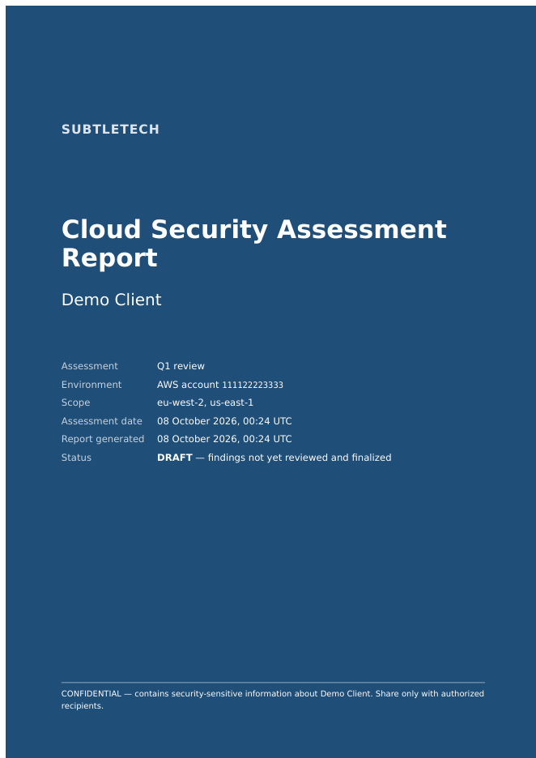
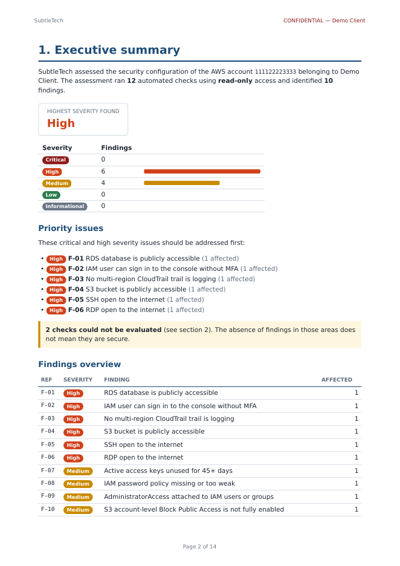

# Report Exports (PDF, JSON and CSV)

Exports are generated from a **saved, hash-verified scan**. The PDF, JSON, CSV and the
dashboard all render the same report dataset (`backend/app/reporting/report.py`),
so they always agree. Decision records:
[ADR 0016](decisions/0016-report-dataset-and-exports.md) (dataset, JSON, CSV) and
[ADR 0022](decisions/0022-pdf-reports.md) (PDF).

In the dashboard, open a scan's report and click **Download PDF report** (or CSV /
JSON). Every download is recorded in the audit log.

## Create exports

```powershell
.\scripts\dev.ps1 assessments list --client "Acme Ltd"                 # find the scan ID
.\scripts\dev.ps1 assessments export --client "Acme Ltd" --scan <scan-id>
.\scripts\dev.ps1 assessments export --client "Acme Ltd" --scan <scan-id> --format pdf
```

Without `--format`, all three files are written. Files go to **`backend\exports\`** in
the project folder, named `<client>_<scan-id-start>_<UTC timestamp>.pdf|json|csv`. The
folder is git-ignored.

> **Exports contain client data.** Store them in the engagement's secure location and
> delete local copies when no longer needed. Existing files are never overwritten.

No AWS account yet? Store sample data and export it:
```powershell
.\scripts\dev.ps1 demo -save "Demo Client"     # prints a scan ID
.\scripts\dev.ps1 assessments export --client "Demo Client" --scan <scan-id>
```

## PDF

The client-facing report:

| Section | Content |
|---|---|
| Cover | Consultancy, client, assessment, environment, scope, dates, **DRAFT** until the assessment is finalized, then **Final** with date and reviewer, confidentiality notice |
| 1. Executive summary | Highest severity found, findings per severity, priority (critical/high) issues, checks that could not be evaluated, findings overview |
| 2. Scope and method | Account, regions, timing, read-only method, checks not evaluated with reasons, every check performed with its limitations |
| 3. Detailed findings | One section per issue (F-01, F-02, …): what is wrong, why it matters, recommendation, affected resources, evidence, framework references |
| Appendix A | Framework mapping: CIS, NIST CSF 2.0 and SOC 2 controls with the related findings |
| Appendix B | Review decisions: accepted risks and false positives, each with its justification, reviewer and date |
| Appendix C | Notes, scan ID and SHA-256 fingerprint |

Findings marked as accepted risk or false positive are not counted in the summary and
detailed findings; they are listed in Appendix B instead, so nothing is silently
dropped. A severity changed on review is shown as the new severity with the original
and the reason next to the resource.

Evidence is summarized (long values are shortened; evidence for more than 25 resources
of one issue is left out); the JSON export always has everything. Every page shows
"CONFIDENTIAL" and the client name.

 

**Safety:** text from the client's environment (resource names, tags, evidence) is
escaped, so it can never become markup in the PDF, and the PDF renderer is not allowed
to load anything: no web addresses, no local files.

## JSON

The complete report: source (consultancy, client, assessment, scan ID and its SHA-256),
scope (provider, account, regions), summary (by severity, category and rule), every
finding with evidence and framework references, everything **not evaluated**, every
check result, and standard notes (no compliance claim; meaning of unverified references).

- Versioned with `schema_version` (currently `1.1`: adds review decisions).
- `source.report_status` is `draft` or `final`. Each finding has a `review` block
  (status, original severity, justification, reviewer). `findings` holds open and
  confirmed findings; `accepted_risks` and `false_positives` hold the rest.
- After finalization the export of the finalized scan is the **frozen snapshot**,
  checked against its stored SHA-256 every time it is served.
- Published contract: [`backend/schemas/assessment-report.schema.json`](../backend/schemas/assessment-report.schema.json)
  (JSON Schema 2020-12). Regenerate with `python -m app.reporting.schema`; a test fails
  if it is out of date.

## CSV

One row per finding (per affected resource), most severe first, for spreadsheet analysis.

| Column | Content |
|---|---|
| `finding_id` | Stable ID (same weakness on same resource = same ID across scans) |
| `severity`, `rule_id`, `title`, `category` | Classification |
| `provider`, `account_id`, `region`, `resource_type`, `resource_name`, `resource_id` | What is affected |
| `detail`, `risk`, `recommendation` | Explanation and remediation |
| `cis`, `nist_csf`, `soc2` | Control IDs; `(unverified)` where not yet checked against the official document |
| `evidence`, `evidence_source` | Evidence summary and the API operation it came from |
| `review_status`, `original_severity`, `review_justification`, `reviewed_by` | Review decision (`severity` is the severity after review) |
| `detected_at`, `client`, `assessment`, `scan_id`, `report_status` | Traceability; `report_status` is `draft` or `final` |

- **Encoding:** UTF-8 with a byte-order mark, so Excel on Windows shows all characters.
- **CSV injection protection:** resource names and other text come from the client's
  environment and could be crafted by an attacker. Spreadsheet programs run cells
  beginning with `=`, `+`, `-`, `@`, tab or carriage return as formulas. Every such
  cell is prefixed with `'` so it is shown as text, never executed.
- Items **not evaluated** are not in the CSV (it lists findings); they are in the JSON
  and the PDF.
