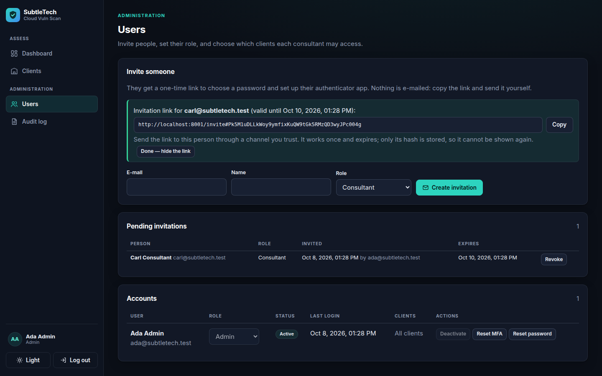

# User accounts and logging in

Everyone who uses the platform has their own account, and **everyone must use an
authenticator app** (multi-factor authentication, MFA). There are two roles:

| Role | Can |
|---|---|
| **Admin** | See every client; create clients; invite users and assign them to clients; reset passwords and MFA; read the audit log |
| **Consultant** | Work only with the clients assigned to them (connections, assessments, scans, reports) |

Design and security details: [ADR 0009](decisions/0009-authentication-and-authorization.md),
[ADR 0020](decisions/0020-authentication-implementation.md).

There is **no public sign-up**: the first administrator is created once (below), and
everyone else is invited ([ADR 0024](decisions/0024-onboarding-and-public-showcase.md)).

## 1. Create the first administrator (once)

**In the browser (recommended).** On a fresh installation, open the dashboard: the
home page offers **Set up this installation**. You need the setup code, shown on the
machine running the platform:

```powershell
.\scripts\dev.ps1 up
.\scripts\dev.ps1 users setup-code
```

Enter the code, your name, e-mail and password, then set up your authenticator app
(step 2 below, from the QR code on). The setup page works only while there are no
users; after that it is closed for good.

**Or on the command line:**

```powershell
.\scripts\dev.ps1 users create --admin --email you@yourcompany.com --name "Your Name"
```

It prints a **temporary password**, shown only once; continue with step 2.

## 2. First login (temporary password)

You need an authenticator app on your phone: Microsoft Authenticator, Google
Authenticator, 1Password, Bitwarden, etc. (SMS is not supported, on purpose.)

Open the dashboard (**http://localhost:5173** in development) and:

1. Log in with your e-mail and the temporary password.
2. Scan the **QR code** with your authenticator app (or type the key shown under
   "Can't scan?"), then enter the 6-digit code it displays.
3. You receive **10 recovery codes**: store them somewhere safe (a password manager).
   Each works once if you lose your phone.
4. Choose your own password (at least 12 characters; a few random words work well).

Later logins: e-mail and password, then the 6-digit code (or "Lost your phone? Use a
recovery code"). Log out with the button at the bottom of the sidebar.

## 3. Invite colleagues (admins)

On the **Users** page, under **Invite someone**: enter e-mail, name and role and click
**Create invitation**. Copy the link that appears and send it to the person yourself
(the platform sends no e-mail). The link:

- works **once** and expires after 48 hours (setting `INVITE_VALID_HOURS`);
- can be **revoked** under *Pending invitations*; inviting the same address again
  replaces the old link;
- is shown only once (only a fingerprint of it is stored).

The person opens the link, sees who invited them and with which role, chooses a
password, and sets up their authenticator app. Then tick the clients each Consultant
may access: until then they see no client data.



## When something goes wrong

| Problem | Fix |
|---|---|
| Lost phone | Use a recovery code, or an admin clicks **Reset MFA** on the Users page. The user sets up MFA again at next login. |
| Forgotten password, or "locked" after 5 wrong tries (wrong passwords and wrong authenticator codes count together) | Wait 15 minutes (lock), or an admin clicks **Reset password** → new temporary password. |
| Nobody can log in (e.g. the only admin lost their phone) | On the server: `.\scripts\dev.ps1 users reset-mfa --email ...` and/or `users reset-password --email ...`. |
| Someone leaves | An admin clicks **Deactivate**: their sessions end at once. |

Sessions end after 30 minutes without activity, and after 12 hours at most.
Every login, change and data access is recorded in the **Audit log** (admins), which
nobody can edit or delete. Everything here is also available through the API
([api.md](api.md)).
